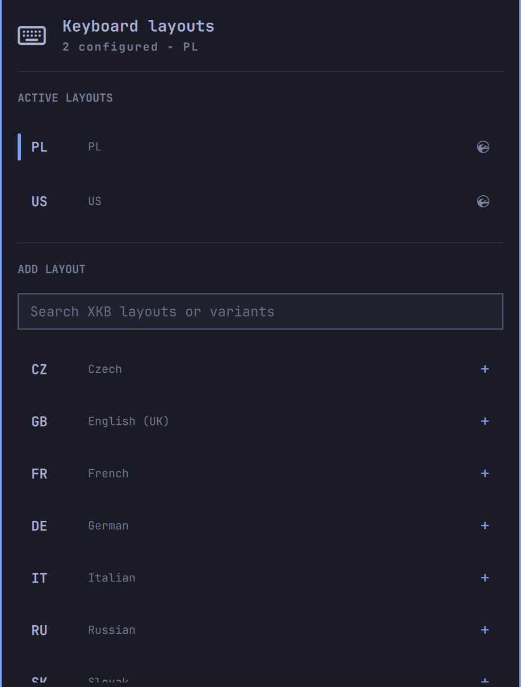

# Keyboard layouts

An [Omarchy](https://omarchy.org/) bar plugin for managing Hyprland keyboard
layouts, without leaving the bar.



## Features

- Shows the active layout in the bar.
- Opens a native Omarchy-style popup with the configured layouts.
- Activates, adds, and removes layouts without editing files manually.
- Searches the installed XKB layout and variant catalogue.
- Persists `kb_layout` and `kb_variant` in `~/.config/hypr/input.lua`.
- Applies changes immediately through Hyprland.
- Full keyboard navigation: arrow keys, Enter, `/` to search, `R` to reload.

The plugin intentionally manages Hyprland only. It does not require `sudo` and
does not change `localectl`, the virtual console, or fcitx5 profiles.


## Requirements

- [Omarchy](https://omarchy.org/) with `omarchy-shell` (Quickshell-based bar).
- [Hyprland](https://hyprland.org/), reachable through `hyprctl`.
- `xkbcli` (ships with `libxkbcommon`) for the layout/variant catalogue.
- `awk` and `bash` (both part of a base Omarchy install) to rewrite
  `~/.config/hypr/input.lua`.

No package is installed, no daemon is started, and no `sudo` is required.

## Install

```bash
omarchy plugin add https://github.com/Majkelll/omarchy-keymaps.git --enable --yes
omarchy bar move io.github.majkelll.omarchy-keymaps --after omarchy.clock
```

To remove it and restore the built-in widget:

```bash
omarchy plugin remove io.github.majkelll.omarchy-keymaps --yes
```

Removing the plugin only removes its files under
`~/.config/omarchy/plugins/`; it does not revert `~/.config/hypr/input.lua`,
so your last applied layout selection is kept.

## Usage

Click the layout label in the bar. The active layouts are listed first. Click
a layout to activate it, use the search field to find another XKB layout or
variant, and click `+` to add it. The last remaining layout cannot be
removed.

Keyboard navigation is available with the arrow keys and Enter. Press `/` to
focus the search field and `R` to reload the XKB catalogue.

## How it works

The bar widget and its popup panel are plain QML, driven by
[`Model.js`](Model.js) for parsing and list logic (kept dependency-free so it
can be unit tested outside Quickshell). Applying a change shells out to
[`scripts/omarchy-keymaps-set`](scripts/omarchy-keymaps-set), a small `bash`
script that:

1. Validates its arguments (layout list, variant list, active index).
2. Rewrites `kb_layout` / `kb_variant` in `~/.config/hypr/input.lua` in
   place, via a temp file plus atomic `mv`.
3. Runs `hyprctl reload` and, if a keyboard device was detected,
   `hyprctl switchxkblayout` to apply the active layout immediately.

## Development

```bash
omarchy plugin validate .
node tests/model.test.js
```

The plugin runs inside `omarchy-shell` and can execute the bundled layout
writer. Review changes before enabling plugins from repositories you do not
control.

## License

[MIT](LICENSE)
